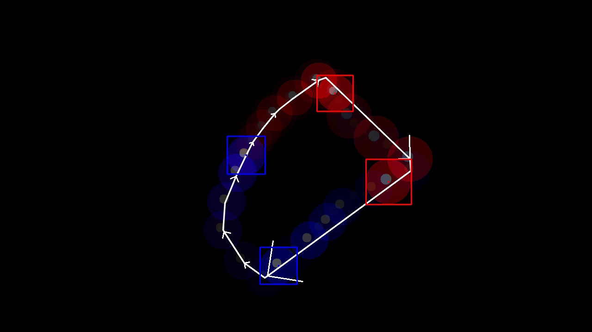
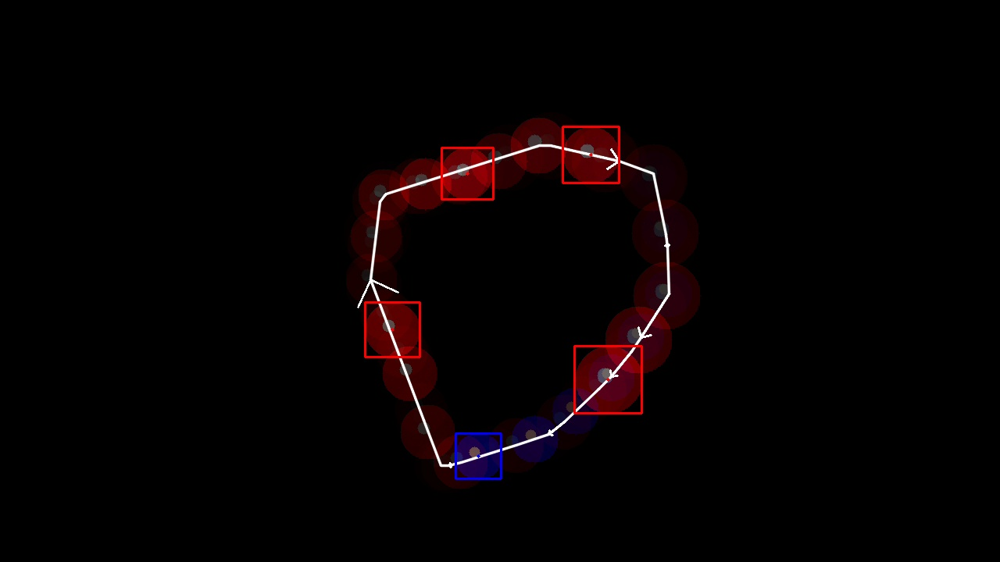

# Balloon Popper

A computer vision project that simulates tracking and targeting red balloons while avoiding blue ones. For now the system uses OpenCV for balloon detection and path prediction from a video.

## Path Prediction Examples
 

## Requirements

- Python 3.x
- OpenCV
- NumPy

## Features

- Generates test videos
- Detects and differentiates between red and blue balloons in a frame
- Predicts path of balloons from a video
- Visualizes detection results and predicted paths
- Future position estimation for balloons

## To Do

- Add target selection
- Add popping of balloons
- Add scoring system